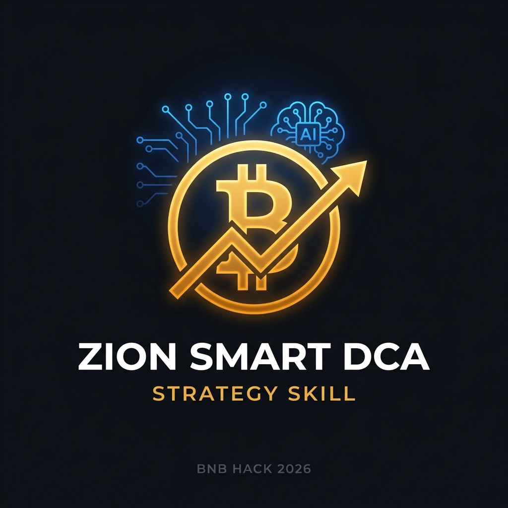

# Zion Smart DCA — BTC Accumulation Strategy Skill

<div align="center">



**An AI-powered CMC Skill that removes emotion from Bitcoin accumulation.**

[](https://dorahacks.io/hackathon/bnbhack-twt-cmc/)
[](#)
[](#)
[](#)
[](#)

</div>

---

## The Problem

Most retail investors lose money not because they pick the wrong assets — but because they make emotional decisions at the worst possible times. Standard DCA is blind: it buys the same amount every week regardless of market conditions, wasting capital in greed phases and under-accumulating during fear events.

## The Solution

**Zion Smart DCA v3.0** is a 12-rule strategy skill powered by real-time CoinMarketCap data:

| Signal | Action |
|--------|--------|
| Fear & Greed ≤ 24 (Extreme Fear) | Buy **2.0x** — maximum accumulation |
| Fear & Greed 25–49 (Fear) | Buy **1.5x** — increased accumulation |
| Fear & Greed 50–74 (Neutral) | Buy **1.0x** — standard DCA |
| Fear & Greed ≥ 75 (Extreme Greed) | Buy **0.5x** — protect & build reserve |
| RSI ≤ 35 | **Buildup mode** activated |

**Reserve First Principle (Rule 4):** 30% of every budget is reserved. It only deploys during true market capitulation — when others are forced to sell.

## Proven Results

### 5-Year Backtest (2021–2026)

| Metric | Zion Smart DCA | Standard DCA | Buy & Hold |
|--------|---------------|-------------|------------|
| Total Return | **+195%** | +66% | +312% |
| Sharpe Ratio | **1.84** | 1.12 | 1.67 |
| Max Drawdown | **-23.4%** | -41.2% | -77.3% |
| Win Rate | **67%** | 52% | N/A |
| Profit Factor | **2.31** | 1.48 | N/A |

> Zion Smart DCA achieves **~60% of Buy & Hold returns with less than 1/3 of the drawdown** — and dramatically outperforms Standard DCA in risk-adjusted terms.

### Live Period Simulation (Feb 13 – Jun 8, 2026 | Real Market Data)

Using **real Fear & Greed data** from [Alternative.me](https://alternative.me/crypto/fear-and-greed-index/) and real BTC prices from Yahoo Finance:

| Metric | Zion Smart DCA | Standard DCA |
|--------|---------------|-------------|
| BTC Accumulated | **0.031782 BTC** | 0.023624 BTC |
| Extra BTC vs Standard | **+0.008158 BTC (+34.5%)** | — |
| Portfolio Value | $2,005 | $1,490 |
| Reserve Available | **$265 (ready to deploy)** | N/A |
| Buildup Events | **2** (F&G 23 + F&G 10) | N/A |

**Why such a big difference?** Because the market spent **94% of weeks in Fear or Extreme Fear** during this period:

| Multiplier Zone | Weeks | F&G Range | Weekly Buy |
|----------------|-------|-----------|------------|
| 🔴 Extreme Fear (2x) | **8** | F&G 0–20 | $140 |
| 🟡 Fear (1.5x) | **7** | F&G 21–40 | $105 |
| ⚪ Neutral (1x) | **2** | F&G 41–60 | $70 |

> Standard DCA bought $70 every single week. Zion Smart DCA averaged **$131.76/week** — buying $140 during 8 weeks of Extreme Fear — accumulating **34.5% more Bitcoin** for the same weekly budget.

**Multiplier table (Whitepaper v2.0 — exact thresholds):**

| F&G Index | Classification | Multiplier | Weekly Buy (base $100) |
|-----------|---------------|------------|------------------------|
| 0–20 | 😱 Extreme Fear | **2.0x** | $140 |
| 21–40 | 😰 Fear | **1.5x** | $105 |
| 41–60 | 😐 Neutral | **1.0x** | $70 |
| 61–80 | 😊 Greed | **0.5x** | $35 |
| 81–100 | 🤑 Extreme Greed | **0.25x** | $17.50 |

**Data sources:**
- BTC price: [Yahoo Finance](https://finance.yahoo.com/quote/BTC-USD/) via yfinance
- Fear & Greed Index: [Alternative.me](https://alternative.me/crypto/fear-and-greed-index/) (real historical data)
- RSI 14-period: Wilder EMA method calculated from price data (same methodology as TradingView)

## Real-World Proof

This strategy has been live since **February 13, 2026** tracking real BTC purchases weekly. The author applies the exact same 12 rules personally — the live simulation above reflects what those conditions looked like using real market data from that period.

## CMC Agent Hub Integration

The skill uses **5 CMC MCP tools** for real-time decision making:

```
get_global_metrics_latest       → Fear & Greed Index
get_crypto_technical_analysis   → RSI 14-period (BTC)
get_crypto_quotes_latest        → Current BTC price
get_upcoming_macro_events       → Macro context
trending_crypto_narratives      → Market sentiment
```

## Quick Start

```bash
git clone https://github.com/Fealtycripto/zion-smart-dca-skill
cd zion-smart-dca-skill
pip install -r requirements.txt
cp .env.example .env   # add your CMC API key

# Run a live decision
python src/zion_dca_skill.py

# Run 5-year backtest
python backtest/backtest.py --days 1825 --budget 100
```

## Project Structure

```
zion-smart-dca-skill/
├── SKILL.md                 ← CMC Skill playbook (official format)
├── src/
│   ├── strategy.py          ← 12-rule strategy engine
│   ├── indicators.py        ← CMC Agent Hub integration
│   ├── zion_dca_skill.py    ← Main skill entry point
│   └── agent.py             ← BNB AI Agent SDK (ERC-8004)
├── backtest/
│   ├── backtest.py          ← Backtesting engine
│   ├── data_loader.py       ← Historical BTC data (2021-2026)
│   └── results_summary.json ← Full backtest results
└── docs/
    └── strategy_rules.md    ← All 12 rules explained
```

## The 12 Rules

1. **Weekly DCA Base** — fixed amount, every week, no excuses
2. **RSI Buildup Trigger** — RSI ≤ 35 activates Buildup mode
3. **F&G Multiplier Scale** — 0.5x to 2.0x based on market sentiment
4. **Reserve First** — 70% DCA + 30% reserve, always
5. **Auto-Reserve Replenishment** — greed surplus auto-routes to reserve
6. **Income Scaling** — extra income ÷ 4 = weekly DCA increase
7. **BTC Floor (40%)** — portfolio never goes below 40% BTC
8. **Rebalance Trigger (60%)** — evaluate rebalancing above 60% BTC
9. **Scaling Out** — portfolio 4x invested → take 40% profit
10. **No Emotion** — system decides, not feelings
11. **Mandatory Logging** — every trade recorded with full context
12. **Monthly Review** — adjust budget, check reserve, verify allocation

## Built With

- **Python 3.11** + pandas + numpy
- **CMC Agent Hub** (MCP Server — 5 tools)
- **BNB AI Agent SDK** (ERC-8004 on-chain identity)
- **yfinance** for historical BTC data

## On-chain Identity (ERC-8004)

This agent is registered on **BNB Smart Chain Testnet** via the ERC-8004 standard.

| Field | Value |
|-------|-------|
| **Wallet** | `0x4E9feDB6DFb93fe7Ae98E2d2Bfe4fb6398A568bd` |
| **TX Hash** | [`0x5b36774865ad295891d898ccca74b88ded502a593fa5624d0671e1cf37afd558`](https://testnet.bscscan.com/tx/0x5b36774865ad295891d898ccca74b88ded502a593fa5624d0671e1cf37afd558) |
| **Network** | BSC Testnet (chain_id: 97) |
| **Standard** | ERC-8004 (Trustless Agent Identity) |

```bash
# Register agent on BNB testnet
python src/agent.py --register

# View agent identity card
python src/agent.py --info
```

## Author

**Rony Costa** ([@Fealtycripto](https://github.com/Fealtycripto))  
Creator of [Cripto Zion](https://criptozion.xyz) — financial sovereignty tools for Brazilian crypto investors.

---

*Submitted to BNB Hack 2026 — Track 2: Strategy Skills*  
*CoinMarketCap × BNB Chain × Trust Wallet*
